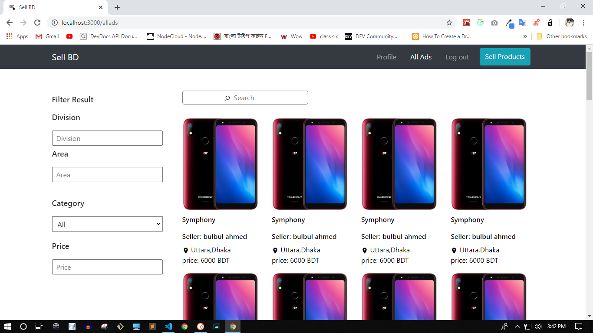
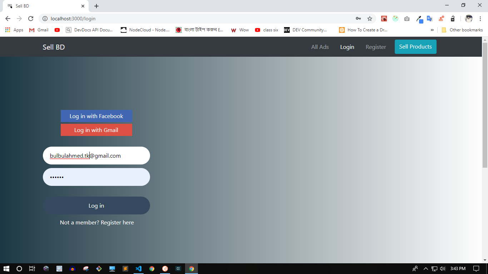

# Sell BD
Buy what you want and Sell what you have

<h3>Overview</h3>

This is a buy sell website. You can see different types of advertisement and
you can contact with seller via email and phone. as well as you can post your own advertisement.

Project Overview video : https://youtu.be/1U6uuDdL49Q 

<h3>Features</h3>
<ul>
  <li>Local Sign Up</li>
  <li>Email Verification</li>
  <li>Login with Facebook</li>
  <li>Login with Gmail</li>
  <li>Own profile and Update phone number information from profile</li>
  <li>different types of advertisements with search and filter. find product, based on category, division, area, price etc. </li>
  <li>Infinite Scrolling. Scroll to load more advertisements</li>
  <li>Post your own advertisements. Add title, location and info. as well as upload most five images of your products. </li>
  <li>And so on....</li>
</ul>

<h3> Technology I have used.. </h3>
<ul>
  <li>React JS</li>
  <li>Redux, Redux thunk, Redux Persist</li>
  <li>Formik, React Hook Form</li>
  <li>Filepond</li>
  <li>React Bootstrap</li>
  <li>Node JS, Express JS</li>
  <li>Mongoose, MongoDB Atlas</li>
  <li>Cloudinary</li>
  <li>Multer</li>
</ul>

<h3>How to run this projects</h3>
  <ul>
    <li>Clone this repsitory</li>
    <li>cd client and run npm install</li>
    <li>cd server and run npm install</li>
    <li>make a .env file in server folder and add these env variable
      
      dbUsername = put your db username without string
      dbPassword = 

      googleClientId = 
      googleClientSecret = 

      cookieKey = 

      fbAppId = 
      fbAppSecret = 

      jwtSecret = 
      sendgridAPI = 
      fromEmail = 

      CLOUD_NAME = 
      CLOUDINARY_API_KEY = 
      CLOUDINARY_API_SECRET = 

      clientURL = http://localhost:3000/profile 
  </li>
  <li>cd client and run npm start</li>
  <li>cd server and run npm run dev</li>
  </ul>
  
  <h3>Screenshot</h3>
  
   
  
  

  
  
   
  
  

  
  
  
